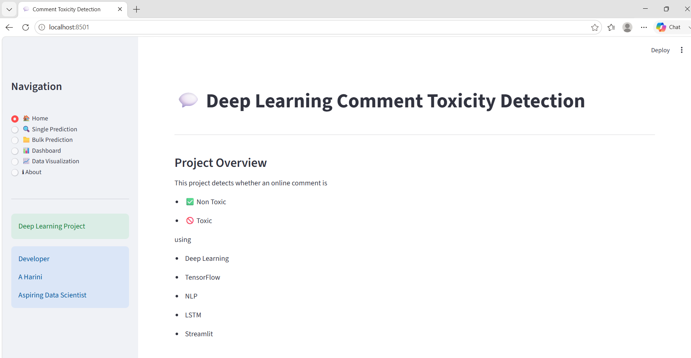

# 🛡️  Deep Learning for Comment Toxicity Detection with Streamlit

## 📌 Project Overview

This project uses **Deep Learning** to automatically classify online comments as **Toxic** or **Non-Toxic**. The model helps identify harmful comments, enabling automated content moderation and safer online communities.

The project includes:

- Data Exploration and Preprocessing
- Exploratory Data Analysis (EDA)
- Text Cleaning and Tokenization
- Feature Extraction using Tokenizer & Padding
- Deep Learning Model (LSTM)
- Model Evaluation
- Single Comment Prediction
- Bulk Comment Prediction
- Interactive Streamlit Dashboard
- Model Serialization using Pickle

---

## 🎯 Problem Statement

Online communities and social media platforms generate millions of user comments every day. While these platforms encourage communication and engagement, they also face challenges from toxic comments such as harassment, hate speech, abusive language, and offensive content.

The objective of this project is to develop a **Deep Learning-based Comment Toxicity Detection model** that automatically classifies comments as **Toxic** or **Non-Toxic**. The model assists moderators by identifying harmful comments, enabling safer and healthier online communities.

---

## 📂 Dataset Information

**Dataset:** `train.csv`

### Features

| Feature | Description |
|---------|-------------|
| comment_text | User comment text |
| toxic | Toxicity label (0 = Non-Toxic, 1 = Toxic) |

---

## 🛠️ Technologies Used

- **Programming Language:** Python
- **Data Manipulation:** Pandas, NumPy
- **Visualization:** Matplotlib
- **Machine Learning:** Scikit-learn
- **Deep Learning:** TensorFlow, Keras
- **Natural Language Processing:** NLTK
- **Web Framework:** Streamlit
- **Model Serialization:** Pickle

---

# 📊 Project Workflow

### Step 1: Data Loading

- Load the dataset into a Pandas DataFrame.
- Explore dataset dimensions.
- Check column names and data types.

### Step 2: Data Cleaning

- Handle missing values.
- Remove duplicate records.
- Clean comment text.
- Convert text to lowercase.

### Step 3: Exploratory Data Analysis (EDA)

- Class Distribution
- Pie Chart
- Comment Length Distribution

### Step 4: Text Preprocessing

- Remove punctuation
- Remove special characters
- Remove stopwords
- Tokenization
- Sequence Padding

### Step 5: Model Development

The Deep Learning model consists of:

- Embedding Layer
- LSTM Layer
- Dropout Layer
- Dense Output Layer (Sigmoid)

### Step 6: Model Evaluation

Evaluate the model using:

- Accuracy
- Loss
- Prediction Results

### Step 7: Save Model

Using Pickle:

- tokenizer.pkl
- toxicity_model.pkl

### Step 8: Streamlit Application

Interactive application providing:

- Home Page
- Dashboard
- Data Visualization
- Single Comment Prediction
- Bulk CSV Prediction
- Model Performance

---

# 📈 Evaluation Metrics

## Accuracy

Measures the percentage of correctly classified comments.

Higher accuracy indicates better model performance.

---

## Binary Crossentropy Loss

Measures prediction error during model training.

Lower loss indicates better performance.

---

# 📷 Streamlit Application Screenshots

## 🏠 Home Page



---

## 📊 Dashboard Overview


---

## 📈 Dashboard Summary


---

## 📊 Class Distribution


---

## 🥧 Toxic vs Non-Toxic Distribution


---

## 📏 Comment Length Distribution


---

## 🔍 Single Comment Prediction


---

## 📂 Bulk Comment Prediction


---

# 📁 Project Structure

```text
COMMENT TOXICITY /
│
├── Report/
│   └── Comment Toxicity Detection Report.pdf
│
├── Screenshots/
│   ├── Home.png
│   ├── Dashboard 1.png
│   ├── Dashboard 2.png
│   ├── Visualization 1.png
│   ├── Visualization 2.png
│   ├── Visualization 3.png
│   ├── Single Prediction.png
│   └── Bulk Prediction.png
│
├── app.py
├── comment analysis.ipynb
├── README.md
├── requirements.txt
├── tokenizer.pkl
├── toxicity_model.keras
├── .gitignore
```

---
## 📂 Dataset

The dataset used in this project is not included in the repository due to its large size.

Place the required dataset files (`train.csv` and `test.csv`) in the project directory before running the notebook or Streamlit application.

---


# ▶️ Running the Project

## 1. Clone Repository

```bash
git clone <repository-url>
```

---

## 2. Install Dependencies

```bash
pip install -r requirements.txt
```

---

## 3. Open Jupyter Notebook

```bash
jupyter notebook
```

Open:

```
Comment_Toxicity_Detection.ipynb
```

---

## 4. Run Streamlit Dashboard

```bash
streamlit run app.py
```

---

# 💼 Business Applications

- Social Media Platforms
- Online Forums and Communities
- Content Moderation Services
- Brand Safety & Reputation Management
- E-learning Platforms
- News Websites and Media Outlets

---

# 🚀 Future Enhancements

- Multi-Class Toxicity Classification
- Transformer-based Models (BERT/RoBERTa)
- Explainable AI (SHAP/LIME)
- Cloud Deployment
- Multilingual Toxicity Detection
- Real-Time Moderation API

---

